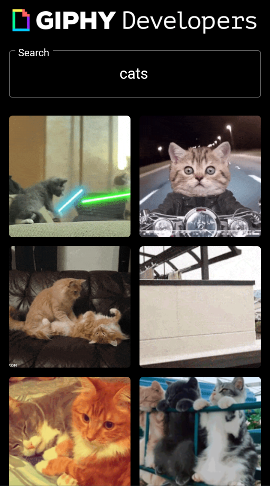

# GIF Explorer 

A really quick experiment. It was a nice way to start working with async requests and other (a bit more complex) features. 

------

## **What I’ve learned?**

**Future & Async:** first time working with async process on a mobile framework. I have to say that it was easier that I thought. The "FutureBuilder" widget made things simple and I got everything working in no time

**Grid Layout:** the grid was the main body of the app. I've learned a lot by building it using the "Grid View" widget. The cell were built individually with its own small function.(?) This helped to get used with a more modular code when it comes to UI

**Share:** it was very quick an easy to set up a share feature with the "share" plugin. Really useful

## **Biggest Challenges**
Falar da montagem da grade e busca pelos gif especificos. 

## **Screenshots** 

- **Screenshot 01**  

- **Screenshot 02**  

